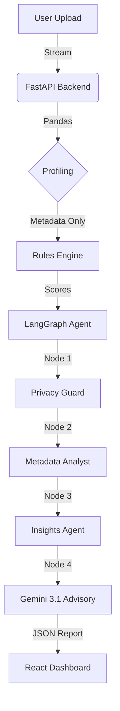

# 🛡️ FinAUDIT: The Autonomous Financial Compliance System

> **Visa AI Hackathon Submission**
> **Core Stack**: FastAPI • LangGraph • React • Google Gemini 3.1 Pro Preview • Recharts

---

## � Prologue: The Compliance Crisis

In the modern financial world, compliance is a bottleneck. Data teams spend thousands of hours manually mapping columns (e.g., "Is 'Billing_Loc' an address?"), running strict arithmetic checks (Basel III), and cross-referencing global standards like GDPR and PCI DSS. A single human error can lead to millions in fines.

**FinAUDIT was born to solve this.**

It is not just a tool; it is an **Autonomous AI Auditor**. It combines the mathematical certainty of code (Deterministic) with the reasoning power of Large Language Models (Probabilistic). This document tells the story of how a raw file becomes a boardroom-ready audit report.

---

## ⚡ Chapter 1: The Ingestion (The Security Gate)

**"Data enters the system, but the risk stays out."**

The journey begins when a user uploads a CSV or Excel file via the secured React Frontend. In a traditional system, this file might be stored dangerously. In FinAUDIT, we use a **Zero-Copy PII Architecture**.

### 1.1 The Ingestion Security (Zero-Copy)

Before any processing happens, the **Python Backend (FastAPI)** captures the file stream in-memory.

- **Profiling**: We use `pandas` to extract _only_ statistical metadata.
- **Data Discard**: The raw rows (containing Names, CC Numbers) are discarded immediately after profiling.
- **Artifact Creation**: The system generates a `metadata` object that represents the _shape_ of the data, not the content.

```json
// The only data that survives Ingestion
{
  "total_rows": 50000,
  "columns": {
    "transaction_amnt": {
      "type": "float",
      "null_percentage": 0.02,
      "min": -50.0
    },
    "customer_ssn": { "type": "string", "unique_count": 49000 },
    "residency_code": { "type": "string", "null_percentage": 15.4 }
  }
}
```

_Technical Note_: This JSON is safe to send to any LLM because it contains no PII, yet it describes the data perfectly.

---

## 🧠 Chapter 2: The Rules Engine (The Logic Core)

**"Before the Agent thinks, the Code verifies."**

We cannot hallucinate compliance. A Credit Card number is either masked (PCI DSS pass) or it isn't (Fail). We built a custom `RulesEngine` in `core/rules_engine.py` that acts as the deterministic foundation.

### 2.1 Smart Column Mapping (Regex Intelligence)

The system does not require users to tag columns. It uses **Advanced Regex Semantics** to "understand" the schema.

| Concept        | Patterns Detected (Partial List) |
| :------------- | :------------------------------- | --------- | --------- | ------------ | ----------- | ------------ | ---------------- |
| **Address**    | `r"address                       | domicile  | residency | municipality | territory   | provenance"` |
| **KYC**        | `r"tin                           | ein       | ssn       | passport     | national_id | govt_id      | driver_license"` |
| **Financials** | `r"principal                     | exposure  | remitter  | beneficiary  | ledger      | gl_code"`    |
| **Security**   | `r"token                         | encyrpted | cipher    | hash         | salt        | key_id"`     |

### 2.2 The Compliance Matrix

Once columns are mapped, the engine executes 30+ strict binary checks across 5 standards:

1.  **Visa CEDP**:
    - _Check_: `visa_no_unauthorized_storage`
    - _Logic_: IF column matches `pan|credit_card` AND format is `raw` (detected via sample stats) → **FAIL**.
2.  **GDPR**:
    - _Check_: `gdpr_storage_limitation`
    - _Logic_: MUST have `retention|purge|ttl` columns present.
3.  **Basel III**:
    - _Check_: `basel_amount_accuracy`
    - _Logic_: `min` value of `amount` columns must be >= 0 (No negative exposure).
4.  **AML/FATF**:
    - _Check_: `aml_suspicious_patterns`
    - _Logic_: Data must contain both `amount` (Volume) and `timestamp` (Velocity) to support audit.
    - _Check_: `aml_kyc_identifier` (Must be Present).

_Output_: A `scores` dictionary (0-100) for every dimension.

---

## 🤖 Chapter 3: The Agentic Brain (LangGraph)

**"The logic finds the errors. The AI explains the risk."**

This is the crown jewel. We use **LangGraph** to orchestrate a State Machine of AI Agents. It is a 4-step pipeline that mimics a human audit team.

### 3.1 The Agent State

Data flows through the graph in this schema:

```python
class AgentState(TypedDict):
    metadata: dict           # The Safe JSON from Chapter 1
    scores: dict             # The Rules Result from Chapter 2
    dataset_type: str        # e.g., "High-Velocity Transaction Ledger"
    insights: str            # "Health is low due to PCI failures"
    privacy_check: str       # "Passed: No SSN in keys"
    analysis: dict           # Final Report
```

### 3.2 The Node Workflow (Deep Dive)

The AI architecture is not a black box. It is a **Sequential State Machine** where each agent passes a structured "State Object" to the next.

#### **Step 1: The Privacy Guardrail 🛡️**

- **Role**: The Gatekeeper.
- **Input**: Raw `metadata` (Column names).
- **Action**: It executes a pre-LLM scan using a restricted keyword list (`ssn`, `password`, `secret`).
- **Logic**:
  - _Safe_: "No PII keys found. Proceed to analysis."
  - _Unsafe_: "ALERT: Column 'user_password' detected." -> **ABORT**.
- **Why?**: To strictly prevent the LLM from even _seeing_ potentially compromised schema keys.

#### **Step 2: The Metadata Analyst 📊**

- **Role**: The Context Engine.
- **Input**: `metadata` + `privacy_check_result`.
- **Action**: It looks at the _combination_ of columns to determine the dataset's purpose.
- **Decision Tree**:
  - IF `amounts` + `dates` + `gl_code` ARE PRESENT → Classify as **"Financial Ledger"**.
  - IF `passport` + `dob` + `address` ARE PRESENT → Classify as **"KYC Identity Data"**.
- **Why?**: A "Missing Address" is critical for KYC data but irrelevant for a General Ledger. Context changes the rules.

#### **Step 3: The Insights Agent 📈**

- **Role**: The Quantitative Scientist.
- **Input**: `scores` (from Rules Engine) + `dataset_type`.
- **Action**: It translates raw numbers into narrative trends.
- **Output Example**:
  > "Health Score is 45/100. While GDPR compliance is perfect (100%), the dataset fails the 'Visa CEDP' check because 15% of rows in the 'Credit_Card' column appear unmasked."
- **Why?**: The LLM needs a summarized "view" of the math, not just a raw dump of 50 score variables.

#### **Step 4: The Advisory Agent (The CCO) 🧑‍⚖️**

- **Role**: Chief Compliance Officer.
- **Model**: **Gemini 3.1 Pro Preview** (Chosen for 128k context window).
- **Input**: `Insight Narrative` + `Detailed Rule Failures` + `Regulatory Text`.
- **Action**: It generates the remediation strategy.
- **Logic**:
  1.  _Identify_: Which failure carries the highest legal penalty? (e.g., Unmasked PAN > Missing Date).
  2.  _Prioritize_: Label fixes as **CRITICAL**, **HIGH**, or **MEDIUM**.
  3.  _Prescribe_: Write specific SQL/Python remediation steps (e.g., "Run `UPDATE table SET pan = MASK(pan)`").
- **Why?**: Compliance is about priority. You fix the jail-time risks first.

---

## � Chapter 4: The Conversation (Split-Stack AI)

**"An independent auditor, accessible 24/7."**

Users can chat with their data. To optimize for latency and cost, we use a **Split-Stack Architecture**:

- **The Auditor (Backend)**: Uses **Gemini 3.1 Pro Preview** for the heavy lifting (Generating the report).
- **The Chatbot (Frontend Interaction)**: Uses **Gemini 3 Flash Preview**.
  - _Why?_ Gemini 3 Flash Preview is fast and cost-effective. It takes the _Report_ generated by Gemini 3.1 Pro Preview as context and answers user questions.
  - _Example User Query_: "Why did we fail the PCI check?"
  - _Bot Response_: "We failed because column 'CC_Num' was detected with unmasked values, violating Visa CEDP Requirement 3."

---

## �️ Chapter 5: The Interface (React & Visualization)

**"Compliance at a glance."**

The Dashboard acts as the mission control.

- **Tech**: React 18 + Vite (for blink-speed HMR) + Recharts.
- **Visualization**:
  - **Health Dial**: An animated gauge showing the global trust score.
  - **Radar Charts**: Comparing performance across dimensions (AML vs GDPR vs Visa).
  - **Remediation List**: A sorted list of actionable fixes, prioritized by the AI (Critical first).
- **UX Detail**: We purposely solved the "Recharts Resizing" bug using absolute positioning tech, ensuring the dashboard looks perfect on 4K monitors and laptops alike.

---

## 🔐 Chapter 6: The Trust Layer (The "Digital Wax Seal")

**"How do we know the AI didn't lie?"**

FinAUDIT uses a **Cryptographic Ledger** to prove that every report is authentic. Think of it like a **Digital Wax Seal** on an envelope.

### 6.1 The Logic (Simple Explanation)

Imagine you are sending a secret letter:

1.  **The Fingerprint**: We take the entire audit report and put it through a mathematical shredder (SHA-256) that turns it into a unique string of characters called a "Hash".
    - _Analogy_: If you change even one comma in the report, the Hash changes completely.
2.  **The Signature**: We stamp this Hash with our **Private Key** (which only the system possesses).
3.  **The Verification**: Anyone with our **Public Key** can unlock the stamp and check the Hash. If it matches, they _know_ the report hasn't been touched since we created it. The public key is published at `GET /api/attestation/public-key`; the private key is held only in the deployment's secret store and is never committed.

### 6.2 The Tech (Under the Hood)

Every API response includes a `provenance` block:

```json
"provenance": {
    "timestamp": "2024-02-02T12:00:00Z",
    "fingerprint": "a1b2c3d4...",           // The SHA-256 Hash
    "signature": "base64_rsa_signature...",  // The RSA-2048 Signed Hash
    "algorithm": "RSA-SHA256"
}
```

**Why is this better than Blockchain?**
It provides the same **Immutability** (you can't fake it) but instantly, without waiting for miners or paying gas fees. It is the perfect "Lite" solution for high-speed audits.

### Architecture Diagram



### Installation

**1. Clone the Repo**

```bash
git clone https://github.com/GaneshArihanth/FinAUDIT.git
cd FinAUDIT
```

**2. Backend Setup**

```bash
cd backend
python -m venv venv
source venv/bin/activate
pip install -r requirements.txt
```

**3. Frontend Setup**

```bash
cd frontend
npm install
npm run dev
```

**4. Configuration (.env)**
Copy `backend/.env.example` to `backend/.env` and fill it in. `.env` is
git-ignored — never commit real keys.

```ini
# For the heavy analysis (Agent)
GOOGLE_API_KEY=AIzaSy_Gemini3.1_Key...
# For the fast chat (Chatbot)
GOOGLE_CHAT_API_KEY=AIzaSy_Gemini3_Key...

# Optional: enables the RapidAPI Gemini fallback. Omit to disable it.
RAPIDAPI_KEY=

# Optional: RSA signing key for attestations (PKCS8 PEM or base64 PEM).
# See "Managing the signing key" below.
ATTESTATION_PRIVATE_KEY=
```

**5. Managing the signing key**
The attestation keypair is **not** part of this repository. On first run the
backend generates one into `backend/keys/` (git-ignored). That is fine for local
development, but on an ephemeral host every restart produces a new key and older
reports stop verifying. For any real deployment, generate a key once and inject
it as a secret:

```bash
openssl genpkey -algorithm RSA -pkeyopt rsa_keygen_bits:2048 | base64
```

Set the output as `ATTESTATION_PRIVATE_KEY` in your platform's secret store.
The matching public key is served at `GET /api/attestation/public-key` so anyone
can verify a report's signature independently.

---

## 🔮 The Future: Why FinAUDIT Matters

Traditional compliance is **Reactive**—you fix issues after the audit fails.
FinAUDIT is **Proactive**—it tells you the risk the moment the data is born.

By strictly separating the "How" (Code/Regex) from the "Why" (AI/Gemini), we have built a system that is:

1.  **Hallucination-Proof**: The AI cannot invent a passing score.
2.  **Privacy-Preserving**: Designed for Banking standards.
3.  **Explainable**: Every decision traces back to a specific Rule ID.

**FinAUDIT: Trust your data.**
