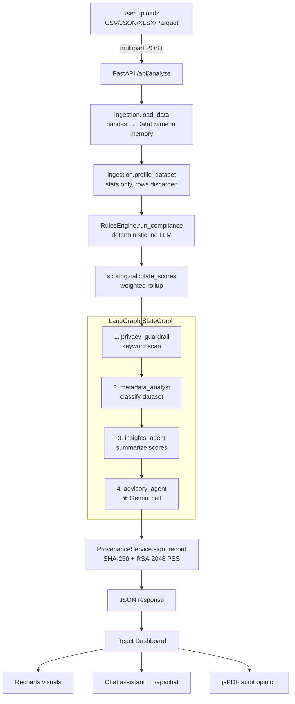

# 🛡️ FinAUDIT — Autonomous Financial Data Compliance Auditor

> **Visa AI Hackathon submission**
> Upload a dataset → get a weighted compliance score across six regulatory standards, an
> LLM-authored remediation plan, a cryptographically signed attestation, and a
> board-ready PDF audit opinion.

**Stack:** FastAPI · LangGraph · Google Gemini · pandas · React 19 + Vite · Recharts · jsPDF · RSA-2048/SHA-256

---

## Table of Contents

1. [What FinAUDIT Does](#1-what-finaudit-does)
2. [Core Design Principle: Metadata-Only](#2-core-design-principle-metadata-only)
3. [System Architecture](#3-system-architecture)
4. [Repository Layout](#4-repository-layout)
5. [The Request Lifecycle](#5-the-request-lifecycle)
   - [5.1 Ingestion & Profiling](#51-ingestion--profiling)
   - [5.2 The Rules Engine](#52-the-rules-engine)
   - [5.3 Scoring](#53-scoring)
   - [5.4 The LangGraph Agent Pipeline](#54-the-langgraph-agent-pipeline)
   - [5.5 Cryptographic Attestation](#55-cryptographic-attestation)
6. [Complete Rule Inventory](#6-complete-rule-inventory)
7. [API Reference](#7-api-reference)
8. [Frontend](#8-frontend)
9. [Configuration](#9-configuration)
10. [Local Development](#10-local-development)
11. [Deployment](#11-deployment)
12. [Security Model](#12-security-model)
13. [Known Limitations](#13-known-limitations)
14. [Roadmap](#14-roadmap)

---

## 1. What FinAUDIT Does

Compliance review of a financial dataset is normally manual: someone maps columns to
regulatory concepts, checks arithmetic invariants, cross-references GDPR/PCI/AML
requirements, and writes up findings. FinAUDIT automates that loop.

You upload a CSV, JSON, Excel, or Parquet file. In one request the system:

1. **Profiles** the file into pure statistics — no raw rows are retained.
2. **Scores** it with a deterministic rules engine against one of six standards.
3. **Explains** the result via a four-node LangGraph agent pipeline ending in a Gemini-authored,
   priority-sorted remediation plan.
4. **Signs** the result with RSA-2048 so the report can be verified as untampered.
5. **Renders** a dashboard, an interactive auditor chatbot, and a downloadable PDF audit opinion.

The deliberate split: **code decides pass/fail, the LLM only explains and prioritizes.**
The model cannot invent a passing score, because it never computes one.

### Supported compliance standards

| Standard | Rules | Total Weight | Focus |
|:---|---:|---:|:---|
| General Transaction | 30 | 100 | Broad data-quality health across 8 dimensions |
| GDPR | 6 | 28 | Purpose limitation, minimization, retention, access logs |
| Visa CEDP | 6 | 26 | Cardholder data handling, transaction completeness, fraud readiness |
| AML / FATF | 6 | 27 | KYC identifiers, jurisdiction, source of funds, traceability |
| PCI DSS | 6 | 25 | CVV/PAN storage prohibitions, lifecycle, track data |
| Basel II / III | 6 | 26 | Exposure accuracy, referential integrity, duplicate prevention |

**60 rules total.** The General Transaction set is weighted to sum to exactly 100.

---

## 2. Core Design Principle: Metadata-Only

The single architectural commitment everything else follows from:

> **Raw data never leaves the request that uploaded it, and never reaches the LLM.**

The uploaded file is parsed into a pandas DataFrame in memory, reduced to a statistical
profile, and the DataFrame is then dropped when the request scope ends. Nothing is written
to disk, no database exists, and no session state persists between requests.

What survives profiling is a description of the data's *shape*:

```jsonc
{
  "total_rows": 50000,
  "total_columns": 3,
  "columns": {
    "transaction_amount": {
      "dtype": "float64", "null_count": 10, "null_percentage": 0.02,
      "unique_count": 48213, "is_numeric": true,
      "min": -50.0, "max": 9900.0, "mean": 213.44, "negative_count": 37
    },
    "customer_ssn": {
      "dtype": "object", "null_count": 0, "null_percentage": 0.0,
      "unique_count": 49000, "is_numeric": false,
      "email_match_count": 0, "email_match_percentage": 0.0,
      "phone_match_count": 0, "phone_match_percentage": 0.0
      // ... one pair per detector
    }
  }
}
```

Column **names** are retained (the rules engine matches on them). Column **values** are not.
This is what makes it safe to send the profile to a third-party LLM: it describes the dataset
precisely while carrying no PII.

---

## 3. System Architecture



**Deployment shape:** one process. FastAPI serves the API under `/api` and the compiled React
SPA from `backend/static` for everything else, so there is no CORS boundary or separate web
server in production.

---

## 4. Repository Layout

```
FinAUDIT/
├── Dockerfile                  Two-stage build: node builds SPA → python serves everything
├── railway.json                Railway deploy config (Dockerfile builder)
├── render.yaml                 Render blueprint + env var declarations
├── .dockerignore / .gitignore  Excludes venv, node_modules, .env, backend/keys, *.pem
├── metadata_only_payment_template_with_row.csv   Sample pre-aggregated metrics file
│
├── backend/
│   ├── main.py                 FastAPI app, CORS, static mounting, SPA catch-all
│   ├── requirements.txt        82 pinned packages (⚠ UTF-16 encoded — see Limitations)
│   ├── .env.example            Template for local secrets
│   ├── keys/                   RSA keypair (git-ignored, generated at runtime)
│   │
│   ├── api/
│   │   └── endpoints.py        4 routes: analyze, re-evaluate, chat, public-key
│   ├── core/
│   │   └── rules_engine.py     500 lines, 60 rules, 6 standards — the deterministic core
│   ├── services/
│   │   ├── ingestion.py        File → DataFrame → statistical profile
│   │   ├── scoring.py          Weighted dimension + overall score rollup
│   │   └── provenance.py       RSA key management, fingerprinting, signing
│   ├── ai/
│   │   └── agent.py            LangGraph graph, 2 LLM clients, RapidAPI fallback, chat
│   │
│   ├── check_models.py         Dev script: list available Gemini models
│   ├── debug_chat.py           Dev script: POST a fixture to /api/chat
│   ├── test_agent_model.py     Dev script: verify a model ID responds
│   └── verify_rules.py         Rule-engine assertions (⚠ stale — see Limitations)
│
└── frontend/
    ├── vite.config.js          Dev proxy: /api → 127.0.0.1:8000
    ├── eslint.config.js        Flat config, react-hooks + react-refresh
    └── src/
        ├── main.jsx            React root
        ├── App.jsx             Single state switch: upload view ⇄ dashboard view
        ├── index.css           Design tokens + glassmorphism component classes
        ├── components/
        │   ├── Layout.jsx         Sticky glass header, export/reset actions, footer
        │   ├── Upload.jsx         Drop zone, file validation, POST /api/analyze
        │   └── ChatAssistant.jsx  Markdown chat UI against /api/chat
        ├── pages/
        │   └── Dashboard.jsx      Charts, KPIs, standard switcher, rule table, chat modal
        └── utils/
            └── reportGenerator.js Formal auditor's report as PDF via jsPDF
```

---

## 5. The Request Lifecycle

### 5.1 Ingestion & Profiling

`services/ingestion.py`

**`load_data(file)`** dispatches on file extension:

| Extension | Reader | Notes |
|:---|:---|:---|
| `.csv` | `pd.read_csv` | Retries with `latin1` on `UnicodeDecodeError` |
| `.json` | `pd.read_json` | |
| `.xls`, `.xlsx` | `pd.read_excel` | Requires `openpyxl` |
| `.parquet` | `pd.read_parquet` | |

Anything else raises `HTTP 400`.

**`profile_dataset(df)`** emits, for every column:

- `dtype`, `null_count`, `null_percentage`, `unique_count`, `is_numeric`

For **numeric** columns it adds `min`, `max`, `mean`, and `negative_count`.

For **string** columns it runs five regex detectors and records both a raw count and a
percentage for each:

| Detector | Pattern | Used by |
|:---|:---|:---|
| `email` | `[^@]+@[^@]+\.[^@]+` | `validity_regex_conformity` |
| `phone` | `^\+?1?\d{9,15}$` | (profiled, not yet scored) |
| `iso_date` | `^\d{4}-\d{2}-\d{2}$` | `validity_date_format`, timeliness |
| `currency_code` | `^[A-Z]{3}$` | `validity_currency_code` |
| `country_code` | `^[A-Z]{2,3}$` | `validity_country_code` |

If a column's `iso_date_match_percentage` exceeds 50, the profiler additionally parses it as
dates and records `min_date` / `max_date` — these feed the timeliness dimension.

### 5.2 The Rules Engine

`core/rules_engine.py` — no LLM involvement whatsoever.

**Dispatch.** `run_compliance(standard)` uppercases the incoming label and substring-matches
it to a rule set: `GDPR` → `run_gdpr()`, `VISA`/`CEDP` → `run_visa_cedp()`, `AML`/`FATF` →
`run_aml_fatf()`, `PCI` → `run_pci_dss()`, `BASEL` → `run_basel()`, anything else →
`run_general()`.

**Column mapping.** Rules never require the user to tag columns. `_get_columns_by_pattern()`
runs a case-insensitive regex over column *names* and returns matches. This is how a column
called `Billing_Loc`, `domicile`, or `residency_code` all register as address data:

```python
addr_cols = self._get_columns_by_pattern(
    r"address|residency|domicile|street|apt|suite|city|town|municipality|"
    r"province|state|region|territory|zip|postal|post_code|country|nation|iso_3166"
)
```

**Rule shape.** Every rule returns the same structure, which is what makes scoring and
rendering uniform:

```python
results["security_pan_storage"] = {
    "score":   0 if pan_cols else 100,   # 0–100
    "weight":  5,                         # contribution to the dimension
    "passed":  not pan_cols,              # binary verdict
    "details": "No PAN stored check"      # shown in the UI and PDF
}
```

The full inventory is in [§6](#6-complete-rule-inventory).

### 5.3 Scoring

`services/scoring.py`

Dimensions are derived from each rule key's prefix — `completeness_kyc_id` belongs to the
`completeness` dimension. For each dimension:

```
dimension_score = (Σ weight of passed rules ÷ Σ weight of all rules) × 100
```

and globally:

```
overall_score = (Σ weight passed across all rules ÷ Σ total weight) × 100
health_score  = overall_score          # currently identical
```

Note that scoring is driven by the **binary `passed` flag**, not the 0–100 `score` field. A
rule scoring 89 with a threshold of `> 90` contributes zero weight, exactly like one scoring 0.
The per-rule `score` is surfaced in the UI for nuance but does not affect the total.

### 5.4 The LangGraph Agent Pipeline

`ai/agent.py`

A `StateGraph` with four nodes wired in a straight line. State flows as:

```python
class AgentState(TypedDict):
    metadata: dict              # profile from §5.1
    scores: dict                # rollup from §5.3
    privacy_check: str          # node 1 output
    dataset_type: str           # node 2 output
    insights: str               # node 3 output
    analysis: dict              # node 4 output — the deliverable
    compliance_standard: str
```

```
privacy_guardrail → metadata_analyst → insights_agent → advisory_agent → END
```

**Only the fourth node calls an LLM.** The first three are deterministic Python. This is a
deliberate cost and reliability choice, and it is worth being precise about it rather than
overselling the pipeline:

| # | Node | Implementation | What it does |
|:--|:---|:---|:---|
| 1 | `privacy_guardrail` | Keyword scan | Flags column names containing `ssn`, `password`, `social_security` before anything is sent onward |
| 2 | `metadata_analyst` | `if`/`elif` on column names | Classifies as *KYC / Identity Data*, *Financial Transaction Data*, or *General Financial Data* |
| 3 | `insights_agent` | String formatting | Condenses the score dict into one sentence naming the sub-100 dimensions |
| 4 | `advisory_agent` | **Gemini call** | Produces the remediation plan as strict JSON |

The advisory prompt pins a priority taxonomy — **CRITICAL** (security gaps, PII exposure,
clear regulatory violations), **HIGH** (financial inaccuracy, missing required fields),
**MEDIUM** (data hygiene), **LOW** (optimization) — and requires this response shape:

```json
{
  "executive_summary": "One sentence on adherence to the selected standard.",
  "risk_assessment": "Short paragraph on compliance risk.",
  "remediation_steps": [
    { "issue": "Brief title", "action": "Specific fix", "priority": "CRITICAL" }
  ]
}
```

**Failure handling is layered**, so a model outage degrades the report rather than breaking
the request:

1. The primary call goes to the configured Gemini model.
2. On a `400/404/429/500`, quota, or DNS error, it falls back to a RapidAPI Gemini proxy —
   **only if `RAPIDAPI_KEY` is set**; otherwise the fallback raises immediately.
3. If the advisory node still fails or returns unparseable JSON, it returns a stub analysis
   and the audit completes with scores intact.
4. `endpoints.py` wraps the whole agent call in its own try/except as a final guard.

There is also a **content-shape patch**: Gemini preview models may return `content` as a list
of parts rather than a string, so both invocation wrappers flatten it before use.

**Two LLM clients** are constructed — `llm_agent` (temperature 0.2, for analysis) and
`llm_chat` (temperature 0.4, for conversation) — reading `GOOGLE_API_KEY` and
`GOOGLE_CHAT_API_KEY` respectively, so analysis and chat traffic can be billed and
rate-limited separately. `llm_chat` falls back to the primary key if the chat key is absent.
**Both are currently pointed at `gemini-3-flash-preview`.**

Keys are read through `get_local_key()`, which parses `backend/.env` directly with
`utf-8-sig` rather than trusting `os.environ` — a workaround for stale shell environments and
BOM-prefixed files written by Windows editors.

### 5.5 Cryptographic Attestation

`services/provenance.py`

Every response carries a signature proving the report has not been altered since generation.

**Fingerprinting** is canonical: the record is serialized with `json.dumps(..., sort_keys=True)`
before hashing, so key ordering cannot change the digest.

**Signing** covers a `timestamp|fingerprint` payload using **RSA-2048 with PSS padding and
SHA-256**:

```json
"provenance": {
  "timestamp":   "2026-02-02T12:00:00.000000Z",
  "fingerprint": "a1b2c3…",
  "signature":   "<base64 RSA-PSS signature>",
  "algorithm":   "RSA-SHA256",
  "verified":    true
}
```

The signed record includes the filename, both scores, and separate SHA-256 digests of the
metadata profile and the AI analysis — so tampering with any of them invalidates the signature.

**Key resolution order** (see [§12](#12-security-model)):

1. `ATTESTATION_PRIVATE_KEY` — PEM or base64-encoded PEM from the platform's secret store
2. `backend/keys/private_key.pem` on disk
3. A freshly generated 2048-bit pair, persisted at mode `600` when the filesystem allows

The public half is served at `GET /api/attestation/public-key` for independent verification.

> **Why not a blockchain?** The property being bought here is tamper-evidence, not distributed
> consensus. A signature delivers that synchronously, with no network, no gas, and no external
> dependency. The tradeoff is that it proves *this key signed this content* — not that the
> content was published at a given time to a neutral party.

---

## 6. Complete Rule Inventory

Rules marked **⚠ stub** always return `passed: True` regardless of the data — they are
placeholders for checks that need capabilities the profiler does not yet extract (cross-dataset
joins, row-level arithmetic, transport inspection). They are listed honestly here because they
inflate scores; see [§13](#13-known-limitations).

### General Transaction — 30 rules, weight 100, 8 dimensions

| Dimension | Weight | Rules |
|:---|---:|:---|
| **Completeness** | 22 | `mandatory_columns` (4), `mandatory_nulls` (4), `address` (3), `kyc_id` (5), `source_of_funds` (3), `audit_trail` (2), `enhanced_data` (1) |
| **Validity** | 18 | `date_format` (4), `currency_code` (3), `country_code` (3), `name_pattern` (3 ⚠), `field_length` (2 ⚠), `regex_conformity` (2), `schema_type` (1 ⚠) |
| **Accuracy** | 15 | `impossible_date` (4 ⚠), `negative_amounts` (5), `arithmetic` (4 ⚠), `null_clusters` (2) |
| **Uniqueness** | 10 | `transaction_id` (5), `composite_key` (3 ⚠), `primary_key` (2) |
| **Consistency** | 10 | `status_mismatch` (4 ⚠), `currency_country` (3 ⚠), `schema_drift` (3 ⚠) |
| **Integrity** | 7 | `referential` (7) |
| **Timeliness** | 6 | `dataset_age` (4), `late_ingestion` (2) |
| **Security** | 12 | `pan_storage` (5), `cvv_storage` (5), `metadata_only` (2 ⚠) |

Selected logic:

- **`completeness_mandatory_columns`** — requires all three of an identifier pattern
  (`id|uuid|guid|ref|key|code|number|token`), a value pattern
  (`amount|value|price|cost|balance|total`), and a temporal pattern
  (`date|time|timestamp|created|modified|period`).
- **`accuracy_negative_amounts`** — for numeric columns whose name matches
  `amount|price|cost|value|balance`, fails if `min <= 0`. Note this treats a legitimate zero
  or a credit/refund as a violation.
- **`timeliness_dataset_age`** — takes the newest `max_date` across all date columns and scores
  `100` at ≤30 days, decaying one point per additional day.
- **`integrity_referential`** — inspects columns matching `.+_id$` (excluding `transaction`)
  and penalizes those with >20% nulls.
- **`security_pan_storage` / `security_cvv_storage`** — hard zero if any column name matches
  `pan|creditcard|card_number` or `cvv|cvc`.

### GDPR — 6 rules, weight 28

| Rule | W | Logic |
|:---|--:|:---|
| `gdpr_purpose_limitation` | 5 | Detects PII columns (incl. biometric, genetic, political, union, religion) |
| `gdpr_data_minimization` | 5 | Penalizes 20 points per PII column that is >80% null (unused data being retained) |
| `gdpr_lawful_basis` | 5 | Requires `consent\|opt_in\|legal\|contract\|agreement\|terms\|policy\|basis` when PII exists |
| `gdpr_storage_limitation` | 4 | Requires `retention\|expires\|ttl\|deleted_at\|archive\|purge_date` |
| `gdpr_access_restriction` | 4 | Requires processing/access log columns |
| `gdpr_metadata_analytics` | 5 | Hard fail on `ssn\|password\|secret\|key\|credential` |

### Visa CEDP — 6 rules, weight 26

| Rule | W | Logic |
|:---|--:|:---|
| `visa_data_classification` | 5 | ⚠ stub |
| `visa_secure_handling` | 4 | ⚠ stub |
| `visa_no_unauthorized_storage` | 5 | Hard fail on `pan\|credit_card\|card_num\|primary_account_number` |
| `visa_transaction_completeness` | 5 | Requires amount **and** currency **and** date patterns |
| `visa_fraud_readiness` | 3 | Looks for `fraud\|avs\|cvv_resp\|risk\|ip\|device\|fingerprint\|geo\|velocity` |
| `visa_cross_system_consistency` | 4 | Requires `trace\|correlation\|uuid\|ref_id\|session\|request_id\|stan\|rrn` |

### AML / FATF — 6 rules, weight 27

| Rule | W | Logic |
|:---|--:|:---|
| `aml_kyc_identifier` | 5 | Requires a customer identity reference |
| `aml_address_completeness` | 5 | Requires **≥2** jurisdictional address columns |
| `aml_source_of_funds` | 5 | Requires origin-of-funds attributes |
| `aml_traceability` | 5 | Requires `customer_id\|account_id\|wallet_id\|iban\|sort_code\|routing_num\|counterparty` |
| `aml_suspicious_patterns` | 4 | Requires both amount (volume) and date (velocity) to enable structuring analysis |
| `aml_audit_trail` | 3 | Requires transaction history columns |

*The only rule set with no stubs.*

### PCI DSS — 6 rules, weight 25

| Rule | W | Logic |
|:---|--:|:---|
| `pci_no_cvv` | 5 | Hard fail on `cvv\|cvc\|cid\|cav\|csc\|security_code` — CVV must never be stored |
| `pci_pan_masking` | 5 | Fails if a PAN column name contains `raw` or `plain` |
| `pci_restricted_access` | 3 | Infers access control from `token\|encrypted\|key_id\|cipher\|access_level\|acl\|role` |
| `pci_secure_transmission` | 3 | ⚠ stub |
| `pci_data_lifecycle` | 4 | Requires TTL/purge/retention attributes |
| `pci_metadata_processing` | 5 | Hard fail on `track1\|track2\|magnetic\|stripe\|chip_data` |

### Basel II / III — 6 rules, weight 26

| Rule | W | Logic |
|:---|--:|:---|
| `basel_amount_accuracy` | 5 | Fails if any exposure/balance/principal column has `min < 0` |
| `basel_arithmetic_consistency` | 4 | ⚠ stub |
| `basel_referential_integrity` | 5 | Scores `100 − avg null%` across `_id`/`code$`/`ref$` columns |
| `basel_duplicate_prevention` | 5 | Requires at least one ID column with `unique_count == total_rows` |
| `basel_cross_ledger` | 3 | Looks for `gl_\|ledger\|book\|accounting\|reconcile` |
| `basel_timeliness` | 4 | ⚠ stub |

---

## 7. API Reference

All routes are mounted under `/api`.

### `POST /api/analyze`

Full audit of an uploaded file.

**Request:** `multipart/form-data` with a single `file` field.

**Response `200`:**

```jsonc
{
  "filename": "transactions.csv",
  "metadata": { /* the profile from §5.1 */ },
  "scores": {
    "overall_score": 68.0,
    "health_score": 68.0,
    "dimension_scores": { "completeness": 72.7, "security": 40.0, /* … */ },
    "rule_results": {
      "security_pan_storage": { "score": 0, "weight": 5, "passed": false,
                                "details": "No PAN stored check" }
      // … one entry per rule
    }
  },
  "analysis": {
    "executive_summary": "…",
    "risk_assessment": "…",
    "remediation_steps": [ { "issue": "…", "action": "…", "priority": "CRITICAL" } ]
  },
  "provenance": { "timestamp": "…", "fingerprint": "…", "signature": "…",
                  "algorithm": "RSA-SHA256", "verified": true }
}
```

**Errors:** `400` on unreadable or unsupported files. If the LLM is unavailable the request
still returns `200` with a stub `analysis` — scores and provenance are unaffected.

### `POST /api/analyze/re-evaluate`

Re-scores an **already-profiled** dataset against a different standard without re-uploading.
This is what the dashboard's standard dropdown calls.

```jsonc
// Request
{ "metadata": { /* profile echoed back from a prior /analyze */ },
  "standard": "PCI DSS" }

// Response
{ "scores": { /* … */ }, "analysis": { /* … */ } }
```

Valid `standard` values: `General Transaction`, `GDPR`, `Visa CEDP`, `AML / FATF`, `PCI DSS`,
`Basel II / III`. Unrecognized values fall through to the General set.

### `POST /api/chat`

Asks the "Independent Auditor" persona a question about a completed audit.

```jsonc
// Request
{ "question": "Why did we fail the PCI check?",
  "context":  { /* the entire /analyze response object */ } }

// Response
{ "response": "Based on our analysis, **pci_no_cvv** failed because…" }
```

The handler assembles a compact context object — health score, classification, row/column
counts, dimension breakdown, every rule result, the AI risk assessment, the remediation plan,
and the column-name list — and passes it to Gemini with an auditor system prompt. The persona
derives a formal opinion from the health score: **Unqualified** (>90), **Qualified** (70–90),
**Adverse** (<70). Responses are Markdown and rendered as such in the UI.

### `GET /api/attestation/public-key`

Returns the RSA public key so anyone can verify a report's signature independently.

```json
{ "algorithm": "RSA-SHA256", "public_key_pem": "-----BEGIN PUBLIC KEY-----\n…" }
```

**Verifying a report:**

```python
import base64, requests
from cryptography.hazmat.primitives import hashes, serialization
from cryptography.hazmat.primitives.asymmetric import padding

pub = serialization.load_pem_public_key(
    requests.get("http://localhost:8000/api/attestation/public-key").json()["public_key_pem"].encode()
)
prov = report["provenance"]
pub.verify(
    base64.b64decode(prov["signature"]),
    f"{prov['timestamp']}|{prov['fingerprint']}".encode(),
    padding.PSS(mgf=padding.MGF1(hashes.SHA256()), salt_length=padding.PSS.MAX_LENGTH),
    hashes.SHA256(),
)  # raises InvalidSignature if tampered
```

### SPA catch-all

Any non-`/api` GET is handled by `main.py`: an exact file match in `backend/static` is served
directly, otherwise `index.html` is returned so client-side routing works on deep links.

---

## 8. Frontend

React 19 + Vite 7. No component library and no CSS framework — styling is a token system in
`index.css` plus inline styles.

### State model

Deliberately minimal. `App.jsx` holds one piece of state, `analysisData`:

- `null` → render `<Upload>`
- populated → render `<Dashboard>`

There is no router, no Redux, and no persistence. "New Scan" sets it back to `null`.

### Components

**`Upload.jsx`** — Drop zone with hover affordances, accepts `.csv,.json,.xlsx`, posts
`multipart/form-data` to `/api/analyze`, surfaces errors inline, and disables the submit button
while in flight.

**`Dashboard.jsx`** (467 lines, the bulk of the UI) —

- **Attestation banner** with the signing timestamp and a truncated SHA-256 fingerprint
- **AI hero panel**: executive summary, risk assessment, and a scrollable remediation list with
  CRITICAL items sorted first and color-coded
- **KPI row**: health score (with a Recharts donut), total records, active columns, passed/total rules
- **Dimension bar chart**: horizontal Recharts `BarChart`, bars colored green >80, amber >50, red below
- **Standard switcher**: re-audits via `/api/analyze/re-evaluate` behind a blocking overlay
- **Collapsible rule table**: every rule with PASS/FAIL chip, rounded score, and audit note
- **Floating chat launcher** opening a near-fullscreen modal

**`ChatAssistant.jsx`** — Message list with auto-scroll, Enter-to-send, loading indicator, and
`react-markdown` rendering so tables and bold text in the auditor's replies display properly.

**`Layout.jsx`** — Sticky glass header with the gradient wordmark, plus Export/New Scan actions
that appear only once data exists.

### Design system

Tokens defined on `:root` in `index.css`:

- **Gradient:** indigo `#6366f1` → violet `#8b5cf6`, with cyan→blue as accent
- **Status:** success `#10b981`, warning `#f59e0b`, danger `#ef4444`
- **Surfaces:** glassmorphism — translucent white cards over `#f8fafc` with `backdrop-filter: blur(12px)`,
  lifted on hover with a shadow plus indigo glow
- **Type:** Inter for UI, JetBrains Mono for fingerprints and filenames
- **Scale:** four radius steps, four shadow steps

The body carries two fixed radial gradients (indigo top-left, pink bottom-right) for depth.

### PDF generation

`utils/reportGenerator.js` builds a formal **Independent Auditor's Report** entirely client-side
with jsPDF + autoTable, following real audit-report structure: Title → Addressee → **Opinion**
→ Basis for Opinion → Key Audit Matters (the AI risk assessment) → a full rule-evidence table
with PASS in audit green and FAIL in audit red → Management's and Auditor's Responsibilities →
signature block → the cryptographic fingerprint in the footer.

The opinion paragraph is selected by health score, mirroring the chatbot's thresholds:
≥90 unqualified, ≥70 qualified, below 70 adverse.

---

## 9. Configuration

Copy `backend/.env.example` to `backend/.env`. **`.env` is git-ignored — never commit real keys.**

| Variable | Required | Purpose |
|:---|:---|:---|
| `GOOGLE_API_KEY` | Yes, for AI output | Gemini key for the LangGraph advisory agent |
| `GOOGLE_CHAT_API_KEY` | No | Separate Gemini key for the chatbot; falls back to `GOOGLE_API_KEY` |
| `RAPIDAPI_KEY` | No | Enables the RapidAPI Gemini fallback. Unset ⇒ fallback disabled |
| `ATTESTATION_PRIVATE_KEY` | Production | RSA signing key, PKCS8 PEM or base64-encoded PEM |
| `ATTESTATION_KEY_DIR` | No | Override the on-disk key location (default `backend/keys`) |
| `PORT` | No | Server port (Docker default `8080`) |

Without `GOOGLE_API_KEY` the system still runs — profiling, all 60 rules, scoring, provenance,
the dashboard, and the PDF all work. Only the narrative sections are replaced with a notice.

**Generating a signing key:**

```bash
openssl genpkey -algorithm RSA -pkeyopt rsa_keygen_bits:2048 | base64
```

Set the output as `ATTESTATION_PRIVATE_KEY`. Base64 is supported because several platforms
mangle multi-line secret values.

---

## 10. Local Development

**Prerequisites:** Python 3.13, Node 20+.

**Backend** (terminal 1):

```bash
cd backend
python -m venv venv
source venv/bin/activate          # Windows: venv\Scripts\activate
pip install -r requirements.txt
cp .env.example .env              # then fill in your keys
uvicorn main:app --reload --port 8000
```

> If `pip install` fails to parse the file, see the encoding note in [§13](#13-known-limitations).

**Frontend** (terminal 2):

```bash
cd frontend
npm install
npm run dev
```

Vite serves on `:5173` and proxies `/api` to `127.0.0.1:8000`, so the browser sees one origin
and CORS never comes into play during development.

Interactive API docs are at `http://127.0.0.1:8000/docs`.

**Other scripts:**

```bash
npm run build     # production bundle → frontend/dist
npm run lint      # eslint flat config
```

---

## 11. Deployment

The `Dockerfile` produces a single self-contained image:

**Stage 1** (`node:20-alpine`) — `npm ci` and `npm run build` to compile the SPA.
**Stage 2** (`python:3.13-slim`) — install Python deps, copy the backend, copy the built SPA
from stage 1 into `backend/static`, set `WORKDIR /app/backend` so bare imports resolve, and
launch `uvicorn main:app --host 0.0.0.0 --port $PORT`.

```bash
docker build -t finaudit .
docker run -p 8080:8080 \
  -e GOOGLE_API_KEY=… \
  -e ATTESTATION_PRIVATE_KEY="$(cat private_key.pem | base64)" \
  finaudit
```

**Render** — `render.yaml` declares a Docker web service in Oregon on the free plan, with
`GOOGLE_API_KEY`, `GOOGLE_CHAT_API_KEY`, `ATTESTATION_PRIVATE_KEY`, and `RAPIDAPI_KEY` as
`sync: false` (set them in the dashboard, never in the repo).

**Railway** — `railway.json` selects the Dockerfile builder, one replica in `us-west2`, with
sleep disabled and restart-on-failure up to 10 retries.

> On both platforms the filesystem is ephemeral. Set `ATTESTATION_PRIVATE_KEY` or every restart
> generates a new key and previously issued attestations stop verifying.

---

## 12. Security Model

**Data handling.** No database, no file persistence, no session state. The uploaded bytes exist
only for the duration of the request, and only derived statistics are returned. Column values
never reach the LLM; column names do.

**Guardrails.** The rules engine hard-fails on column names indicating stored PAN, CVV, or
magnetic-stripe track data. The `privacy_guardrail` node independently flags `ssn`, `password`,
and `social_security` before the metadata continues through the pipeline.

**Secret management.** No credential is committed. The Gemini keys, the RapidAPI key, and the
attestation signing key all come from the environment or from git-ignored local files.
`backend/keys/` and `*.pem` are excluded from both git and the Docker build context, so keys are
never baked into an image.

**Attestation integrity.** The signing key is the root of trust for every report. Anyone holding
it can forge a "verified" audit, which is why it is kept out of the repository and injected as a
platform secret.

> **Historical note.** An earlier revision of this repository committed both an RSA keypair and a
> RapidAPI key. Those secrets remain reachable in git history on existing clones and forks, and
> must be treated as permanently compromised. The keypair has since been rotated and the RapidAPI
> key must be revoked at the provider. Rotating a file does not un-publish a secret.

**Known gaps.** These are honest and intentional for a hackathon build:

- CORS is `allow_origins=["*"]`. Fine when the SPA is same-origin in production; tighten before
  exposing the API standalone.
- There is no authentication, rate limiting, or upload size cap. A large file is read fully into
  memory by pandas.
- `/api/chat` and `/api/analyze/re-evaluate` accept their context and metadata from the client,
  so a caller can submit fabricated scores and receive commentary on them. The signature on the
  original `/analyze` response is what distinguishes a genuine report.

---

## 13. Known Limitations

Documented deliberately — these are the honest edges of the current build.

**15 of 60 rules are stubs.** They return `passed: True` unconditionally, and because scoring is
weight-based they establish a score floor:

| Standard | Stubbed weight | Of total |
|:---|---:|---:|
| General Transaction | 29 | 100 |
| Visa CEDP | 9 | 26 |
| Basel II / III | 8 | 26 |
| PCI DSS | 3 | 25 |
| GDPR / AML | 0 | — |

They need row-level or cross-dataset access the metadata-only profile does not provide — closing
that gap without weakening the privacy guarantee is the central open design problem.

**Dimension breakdown collapses on specialized standards.** Dimensions come from the rule key
prefix, so every GDPR rule lands in one `gdpr` bucket. The dashboard's dimension chart therefore
renders a single bar for any standard other than General Transaction, which has eight.

**Column-name matching is the only mapping signal.** A perfectly compliant dataset with opaque
column names (`col_1`, `f_042`) scores poorly, and a non-compliant one with reassuring names can
score well. Value-level inspection would fix this at some cost to the privacy model.

**`accuracy_negative_amounts` flags legitimate values.** It fails on `min <= 0`, so refunds,
credits, and genuine zero-value transactions register as violations.

**Both LLM clients use the same model.** The split-stack design (heavier model for analysis,
faster model for chat) is fully wired — separate clients, separate keys, separate temperatures —
but both are currently configured as `gemini-3-flash-preview`. Changing the analysis model is a
one-line edit in `ai/agent.py`.

**FAISS/RAG is dead code.** `build_compliance_rag()` constructs a vector store that nothing calls;
`chat_about_dataset()` deliberately passes the entire report as context instead. The embeddings
client and `faiss-cpu` dependency exist only for that unused path.

**`requirements.txt` is UTF-16 encoded** (a `pip freeze >` artifact from PowerShell). Some pip
versions cannot parse it. Convert with:

```bash
iconv -f UTF-16 -t UTF-8 backend/requirements.txt > /tmp/req.txt && mv /tmp/req.txt backend/requirements.txt
```

**`verify_rules.py` is stale.** It calls `engine.run_all()`, which was renamed to
`run_compliance()`. The script needs updating before it will run.

**Zero-row datasets are handled, but unhelpfully.** A completely empty file surfaces as
`HTTP 400` (pandas raises `EmptyDataError`, which ingestion wraps). A headers-only file with no
rows profiles and scores without error — every division site is guarded — but produces a
meaningless report scored against zero evidence rather than an explicit "insufficient data"
result.

**`run_visa_cedp` is defined twice** in `rules_engine.py`. Python keeps the second definition
(the expanded one, which is the intended behavior), but the shadowed first copy is a maintenance
trap.

**`__pycache__/*.pyc` files are tracked in git** despite matching `.gitignore`, so they surface as
spurious diffs. Untrack with `git rm -r --cached backend/*/__pycache__`.

---

## 14. Roadmap

1. **Replace the stubs.** Compute cross-field arithmetic, date plausibility, and schema drift
   during profiling so the checks become real without retaining rows.
2. **Two-level rule keys.** Give every rule an explicit `dimension` field instead of parsing the
   prefix, restoring the dimension chart for all six standards.
3. **Value-level detectors under the privacy boundary.** Luhn checks for PAN, entropy checks for
   tokenization — computed during profiling, with only the verdict retained.
4. **Persisted attestation ledger.** Append-only storage of fingerprints so reports are verifiable
   after the fact, not just at generation.
5. **Multi-standard view.** Score against all six standards in one pass and render them side by side.
6. **Hardening.** Upload size limits, streaming/chunked profiling for large files, rate limiting,
   and scoped CORS.

---

## Why It Matters

Traditional compliance is **reactive** — you discover problems when an audit fails. FinAUDIT is
**proactive**: it surfaces regulatory risk the moment data lands, before it propagates into
downstream systems and reports.

The structural bet is the separation of concerns: **deterministic code owns the verdict, the
language model owns the explanation.** That makes the output hallucination-resistant (the AI
cannot invent a passing score), privacy-preserving (the model never sees a raw value), and
explainable (every conclusion traces to a named rule with a weight and a threshold).

**FinAUDIT: trust your data.**
